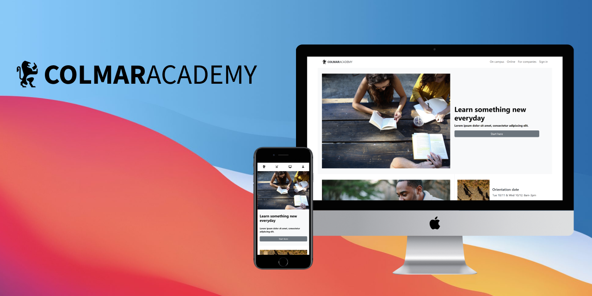

<header>

<!-- shield-status -->
<div align="center">

<a target="_blank" href="https://github.com/sukitb/colmar-academy/commits/main"></a>
<a target="_blank" href="https://github.com/sukitb/colmar-academy/issues"></a>

</div>

</br>

<!-- banner -->
<div align="center">
<a target="_blank" href="https://sukitb.github.io/colmar-academy/"></a>
<h3>Colmar Academy</h3>
 <p align="center">
    <p>Responsive Landing Page for School.</p>
    <a target="_blank" href="https://sukitb.github.io/colmar-academy/"></a>
  </p>
</div>

<main>

## About this project
Colmar Academy project is capstone project from [Build a Website with HTML, CSS, and Github Pages](https://www.codecademy.com/learn/paths/learn-how-to-build-websites) skill path by [Codecademy](https://www.codecademy.com/). The project is the final exercise to conclude the learning in building a responsive website using HTML5, CSS3 and GitHub pages. In this project, I consider to use Bootstrap (CSS framework) for manage page's layout easier. 

## Project overview

<details>
<summary>Wireframe</summary>
<a href="https://content.codecademy.com/courses/freelance-1/capstone-2/colmar-academy-spec.png?_gl=1*19rohb5*_ga*MTcyOTA4MjA2Mi4xNjU0MTU2MDA1*_ga_3LRZM6TM9L*MTY1NTMwMjk3MS40Ni4xLjE2NTUzMDI5OTMuMzg."></a>
</details>

<details>
<summary>Screenshots</summary>


</details>

<details>
<summary>Demo</summary>
    <a target="_blank" href="https://sukitb.github.io/colmar-academy/"></a>
</details>

## Languages & tools

<table>
<tr>
<td align="center"><strong>Languages & tools</strong></td>
<td align="center"><strong>Description</strong></td>
</tr>
<tr>
<td><a target="_blank" href="https://www.codecademy.com/learn/paths/learn-how-to-build-websites"></a></td>
<td>project's wireframe</td>
</tr>

<tr>
<td><a target="_blank" href="https://developer.mozilla.org/en-US/docs/Web/HTML"></a></td>
<td>for building webpage</td>
</tr>

<tr>
<td><a target="_blank" href="https://developer.mozilla.org/en-US/docs/Web/CSS"></a></td>
<td>for styling and spacing webpage</td>
</tr>

<tr>
<td><a target="_blank" href="https://getbootstrap.com/"></a></td>
<td>for manage layout and ready to use component</td>
</tr>

<tr>
<td><a target="_blank" href="https://git-scm.com/about"></a></td>
<td>for version control</td>
</tr>

<tr>
<td><a target="_blank" href="https://docs.github.com/en/pages"></td>
<td>for deploy webpage</a></td>
</tr>

<tr>
<td><a target="_blank" href="https://docs.github.com/en"></td>
<td>for hosting repository</td>
</tr>

</table>


<!-- ## What the project does
- Transform a wireframe document into a website. 
- Use HTML -->

## Get started with the project
1. Clone my repo
```sh
git clone https://github.com/sukitb/colmar-academy.git
```

2. Use your creative ! 💡

## What I learned from the project
This is my first capstone project. I've learned a lot since starting the project. Such as 
- I learned how to building responsive landing page that refer from wireframe by using HTML5 CSS3 and Bootstrap.
- I learned how to use Bootstrap.
  
  - mananging spacing that come from Bootstrap's class with CSS.
  - using row and column for manage webpage's layout.
  - using ready to use component for styling webpage.
- I learned how to use version control with git command line.
- I learned how to store my repository with GitHub.
- I learned how to use GitHub pages to deploy webpage.

## Acknowledgments
<!-- PROJECT ACK -->
<details>
<summary>Project</summary>

- <a target="_blank" href="https://www.codecademy.com/learn/paths/learn-how-to-build-websites">Codecademy</a>
- <a target="_blank" href="https://developer.mozilla.org/en-US/docs/Web/HTML">HTML</a>
- <a target="_blank" href="https://developer.mozilla.org/en-US/docs/Web/CSS">CSS</a>
- <a target="_blank" href="https://getbootstrap.com/">Bootstrap</a>
- <a target="_blank" href="https://git-scm.com/about">Git</a>
- <a target="_blank" href="https://docs.github.com/en">GitHub</a>
- <a target="_blank" href="https://docs.github.com/en/pages">GitHub pages</a>

</details>

<!-- README ACK -->
<details>
<summary>README</summary>

- <a target="_blank" href="https://github.com/othneildrew/Best-README-Template">othneildrew
/Best-README-Template</a>
- <a target="_blank" href="https://shields.io/">Sheilds.io</a>
- <a target="_blank" href="https://github.com/alexandresanlim/Badges4-README.md-Profile">alexandresanlim/Badges4-README.md-Profile</a>
- <a target="_blank" href="https://www.figma.com/community/file/988547939970295144">Web/Mobile — Template Website</a>
- <a target="_blank" href="https://www.figma.com/community/file/970586112005772863">Browser Mockups with Variants</a>
- <a target="_blank" href="https://www.figma.com/community/file/939653933338991115">iPhone Browsers - Safari & Chrome (iOS 15)</a>

</details>

</main>

---

<!-- REACH ME ON -->
<footer>
<div align="center">

## 🤝🏼Reach me on

<a target="_blank" href="https://sukitb.github.io"></a>
<a target="_blank" href="https://sukitb.github.io"></a>
<a target="_blank" href="https://www.linkedin.com/in/sukit-bunsiri-2a2020203/"></a>

<a target="_blank" href="https://sukitbunsiri.medium.com"></a>
 </div>
</footer>
